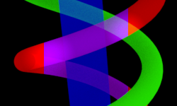
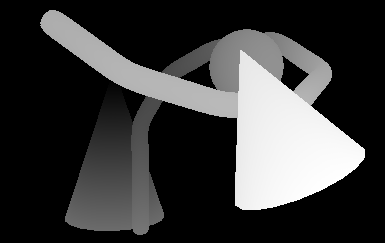
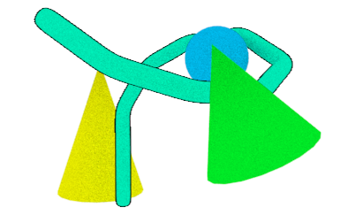

This is a utility to transform deep EXR files and output shallow EXR files.
Supported operations include:

- Extracting layers based on object ID to allow compositing in 2D graphics packages
with poor or no deep compositing support, like Photoshop and After Effects.  The
output layers can be composited together easily, and color filters can be applied
with correct transparency and antialiasing, even when layers overlap in complex ways.

The red helix is a single layer even where it goes underneath the cylinder, and
color and exposure changes have been made to it with ordinary Photoshop tools:



- Masks can be created (or used from deep EXR channels) and extracted.  This allows
creating a mask from depth information, normals or world position that can be used
to mask 2D effects.

This mask is based on the distance of each pixel from the tip of the left cone:



- Layers can be stroked (outlined).  This effect is nearly identical to the Photoshop
stroke effect, but can be applied to individual objects, and the stroke will be
occluded by objects closer to the camera.
- Strokes can include self-intersections, using edge detection based on depth.



The output works with any image editing software that supports basic EXR files, without
requiring deep compositing support.  This idea is based on
<https://github.com/MercenariesEngineering/openexrid>.

# Download

2017-05-29-1: [Windows](https://s3.amazonaws.com/exrflatten/exrflatten-2017-05-29-1.zip)

# Basic instructions

- Add an ID channel to your EXR output and assign the ID 1000 to an object.  Render a deep EXR
file.
- Render a deep EXR file with object ID samples.  This is tested with Arnold renders
out of Maya.  The EXR channel names should be "R", "G", "B", "A", "Z", "ZBack" and
"id".
- Run the tool:
```
exrflatten --input=input.exr --save-layers --layer=1000=MyObject
```

This will extract objects with ID 1000 as "MyObject".  Objects with other
IDs will be in a default layer.

- In Photoshop, add all color output EXRs to a document.  Lower numbered files must be
lower in the compositing order.  *Important*: The document must be 32-bit for Photoshop
to blend the layers correctly.

The image should now look like the original render, and you can make color adjustments
to individual object layers.

# Masks

OpenEXR files can contain a lot of data which can be hard to access from 2D tools, such as
depth, position and orientation information.  The [--create-mask](#operation---create-mask) operation
can help convert complex EXR data to a simple monochrome or alpha mask, which can be easily
imported into any tool.

A **facing** mask can convert world space normals to a mask.  (Alternatively, you can render
a facing channel at render time and use it directly.)  The mask can be reoriented, to give
a mask for parts of objects facing in a particular direction.

A **depth** mask generates a mask from the distance to an object.  This can be used to mask
a blurred copy of the image for a cheap depth of field effect, or to mask color correction to
make objects further away darker or create a fog effect.

A **distance** mask creates a mask from the distance from a specified point to an object.

# Strokes

Strokes (outlines) can be applied to layers to create an ink line effect.  Each layer is
stroked separately, and strokes inherit the depth of their object.  This allows objects
to have an outline even if they're on top of another object, and for outlines to be
occluded by objects closer to the camera.

Intersection lines can also be added, to add ink lines where an object intersects itself
in the same layer.  This is done with world space-based edge detection.

The [--stroke](#operation--stroke) command adds strokes:

``--stroke=1 --radius=1 --intersections``

- 1 is the object ID to stroke.
- --radius sets the thickness of the stroke.
- --intersections causes intersection lines tol be drawn.

See [--stroke](#operation---stroke) for a complete list of arguments.

Intersection lines have some limitations:

- This is actually a stroke effect, created by generating a mask and then applying a stroke
to it.  This can cause holes in the outline where two intersections meet.
- Edge detection by depth isn't perfect.
- Intersection lines and outline strokes are added separately, and don't always join up
perfectly.

### Stroke masks

By default, a stroke is applied to the whole object.  You can control which parts of the object
have an outline with a stroke mask.  This can be generated with [--create-mask](#operation---create-mask),
or a channel in the input EXR file can be used.  For example:

``--stroke=1 --stroke-mask=StrokeMask``

A mask can also be used to control intersection lines:

``--stroke=1 --intersections --intersection-mask=IntersectionMask``

Areas which are black in the mask won't generate a stroke.  The same mask can be used for both
strokes and intersections, or you can use a separate mask for each.

### Putting strokes in their own layer

By default, strokes are added to the layer they're on.  Strokes can also be output into a
new layer, by specifying an output-id:

``--stroke=1 --output-id=2``

This will read object ID 1, and output the stroke as object ID 2.  To output it into its
own file, you also need to include this object ID as a layer:

``--save-layers --layer=2=ObjectStroke``

The stroke will then be output as a separate layer.  This makes it easy to mask the stroke
further during compositing.

Note that strokes are partially on top of the object and partially below, due to the way
strokes are blended, which means that the stroke layer will have some of the object's color.
This means that any color corrections applied to the object need to be applied to the stroke
layer as well.

# Sample

See sample/sample.psd shows how this can be used.  This sample applies several color
adjustments to objects in the scene.  The adjustments affect the intended objects, even
though the objects overlap each other in complex ways, with both helixes being both
in front of and behind each other and the blue cylinder.

The source scene ``sample.ma`` can be rendered with Maya 2017 using Arnold, which
will output sample.exr.  These files were generated by create-samples.sh.
To generate the flattened images, run:

The PSD is linked to these files, and will update automatically.  (If Photoshop doesn't
connect the linked images correctly, you may need to re-link them the first time.)

# Multiple input files

If more than one input render is specified, they'll be combined.

When 3D renderers render a scene, they don't include samples for objects that aren't visible
to the camera.  If you render a scene with two objects, and one is covering up the other so
the camera can't see it, there won't be any data for it.

With deep EXR, you can render the scene twice: once with just the front object, and once with
just the rear one.  (In Maya, this is done by toggling Primary Visibility, which makes the
object invisible but still cast shadows and reflections on other objects.) This gives two
images, one with each object.  If you then specify both images as inputs, the layers can now
include both objects.  If you hide or mask the front object, the one behind it becomes visible.
(You need to set the layer order appropriately for this to happen.  If the front object is in
a lower compositing layer this won't be possible.)

You could do this by importing the two original EXR layers, but that becomes complicated if you
have several layers, such as a scene layer containing things in the environment that might be
both in front of and behind your characters.  You have to separate foreground and background
elements yourself to composite them correctly.  That's one of the problems that deep compositing
solves, and EXR layering provides that solution to simple compositing as well.

# Scene scale

Some operations are dependent on scene scale.  By default, the input is expected to be in 1cm
scale.  If your scene has a different scale, this can be set with ``--scale=meters``, ``--scale=feet``,
or an arbitrary scale such as ``--scale=100`` (also meters).

# Layering details

The output should be correct regardless of the order you specify for layers.  If an object
is behind another object, but is on a higher layer, the output will be adjusted to compensate.
If you're just making color adjustments, this is automatic and can be ignored.  However, if
you want to mask objects, specifying a good layer order will give more useful results.

Suppose a box is in front of a wall, with the box as object 1 and the wall as object 2.  If you specify

``--layer="1=Box" --layer="2=Wall"``

the **Wall** output layer will be on top of the **Box** layer.  The silhouette of **Box**
will be cut out of **Wall** in the result, to prevent the wall (which you're actually putting on top)
from covering up the box.  This is fine if you're just adjusting colors and will give correct
results, but isn't optimal.

If you reverse the order with ``--layer="2=Wall" --layer "1=Box"``, the **Box** layer is now
on top.  The output no longer has to do any tricks to make everything visible.  This means
you can hide or mask the box layer, and you'll see the wall behind.  This wasn't possible
with the other order.

In some cases, objects will mutually cover each other:


Here, the helixes are on top of each other, and no object is always on top of any other
object.  There's no layer ordering that can match this perfectly.  This is the basic limitation
of flat layers, and you need real deep compositing support to get full control here.  The results
will be correct and can be used for color adjustments, but you can't hide one layer without
the cutouts in the other being visible.

# Advanced usage

Operations are executed in the order they're given, and manipulate the image in memory.
Subsequent operations can see the results of earlier ones.  This allows some interesting
possibilities:

- Generate a mask from distance to a point, and then apply the mask to a stroke.  This
allows outlining an object near a particular point.  Note that the mask won't be useful
after applying a stroke, because the stroke will add samples without mask data.  If you
want to output a mask, add it *after* manipulating the image.
- **--save-layers** and **--save-flattened** save the image at the current time.
This allows saving multiple copies of the file, each at a different point.

# Commandline reference

A series of operations can be specified on the commandline, which will be executed in
order.  The order is significant.  For example, if you generate a mask, future commands
can use that mask, but earlier commands can not, and the generated mask will include
any changes made by earlier commands.

### Global options

Global options come first on the commandline:

**--input=file.exr** Adds an input file.  All input files will be read and combined before executing
any commands.  
**--output=path** Specify the directory to hold input files.  This path will be prefixed to
all output paths.  
**--scale=[cm|meters|feet|#]** Set the scene scale (default: cm).  "meters" is an alias for 100,
and "feet" is an alias for 30.48.

### Operation: --save-flattened

**--save-flattened** saves a single flattened image, with all objects merged.

``--save-flattened=output.exr``

### Operation: --save-layers

**--save-layers** splits the current image into a list of layers according to object ID,
and saves the layers as a set of numbered EXR files.  This operation can be followed
by the following options:

- **--layer=1=Name** Add a layer to be saved.  The first argument, **1**, is the object
ID to save.  The second argument is the name of the layer, which is used as the **<Name>**
filename substitution.  Note that a default layer is added automatically if any objects
have IDs not specified by a **--layer** option.
- **--filename-pattern=&lt;Name&gt;.exr** Set the pattern used to generate filenames.  See [filename patterns](#--save-layers-filename-patterns).  
- **--layer-mask=options** Add a mask to the layer set.  See [masks](#--save-layers-masks).  
- **--combine=1,2** Combine one object ID into another before saving the layer set.  This is
useful if you have lots of object IDs and want to manipulate them separately, but you want
layers to be saved with objects combined to reduce the number of layers.  Objects with the
second object ID, **2**, will be combined into the first object ID, **1**.

### --save-layers: filename patterns

The **--filename-pattern** option to **--save-layers** sets how filename patterns are generated.

The default pattern is ``<inputname> <ordername> <layer>.exr``, which gives filenames like ``render #1 main color.exr``.

Substitutions:

- **&lt;name&gt;** The layer name set by the **--layer** option.
- **&lt;order&gt;** The order that this layer is to be composited.
- **&lt;ordername&gt;** If this is a mask, this is the same as **&lt;name&gt;**.  Otherwise,
this is **#&lt;order&gt; &lt;name&gt;**.
- **&lt;layer&gt;** The layer type: **color** for regular color layers, and the mask name set
by **-layer-mask** for masked layers.
- **&lt;inputname&gt;** The input filename, with the extension removed.
- **&lt;frame&gt;** If the input filename has the format **abcdef.1234.exr**, this is the frame
number, **1234**.

### --save-layers: masks

A list of masks can be specified when saving layers.  For each layer output, the mask will
be applied and saved as a separate file.

**--save-layers** takes a single argument specifying how to save the layer, which is a semicolon-separated
list of options:

- **channel** The channel containing the mask.  This option is required.  This can be a channel
in the input EXR, or a mask channel created with [--create-mask](#operation---create-mask**).
- **name** The name of the output mask.  This will be available as the **&lt;layer&gt;** filename
substitution.
- **grey** Output a greyscale mask.
- **alpha** Output an alpha mask.  This mode is useful in combination with Photoshop clipping
masks.
- **rgb** Composite the mask onto the layer color, and output the result.

### Operation: --create-mask

**--create-mask** generates a mask from other channels in the input image.  The mask can then
be used with other commands, like [--save-layers](#operation---save-layers) and [--stroke](#operation--stroke).

The argument to **--create-mask** is the mask mode:

- **--create-mask=facing** Generate a facing angle mask using normals and the camera position.
- **--create-mask=depth** Generate a mask from camera depth.
- **--create-mask=distance** Generate a mask based on distance from a given point.

This command takes the following options:

- **--name=MaskName** Set the name of the mask to create.  This argument is required.
- **--src=SourceLayer** Specify the EXR layer to read.  By default, a layer is chosen based
on the type.
- **--min=1** **--max=10** Specify the minimum and maximum value for the mask.  For depth, this
is the depth range from the camera.  For distance, this specifies the nearest and furthest
distance for the mask.  Values out of this range will be clamped to 0-1.
- **--noclamp** If set, values won't be clamped to the 0-1 range.
- **--invert** If set, invert black and white in the map.
- **--normalize** Automatically normalize the map, so the smallest value is black and the highest
value is white.
- **--angle=1,0,0** For type=facing, set the direction to measure the angle from.  By default,
this is 1,0,-1, which is towards the camera.  This can be used to create a mask for surfaces
facing in a particular direction.
- **--pos=0,0,0** For type=distance, set the world space point to measure from.

### Operation: --stroke

Add a stroke to the image, with optional intersection lines.  The argument to --stroke is an
object ID: **--stroke=1**.

This command takes the following options:

- **--radius=1** The radius of the stroke.  Higher values make the outline thicker.
- **--fade=1** The radius of the stroke fade-off.  Higher values make the outline fade out over
a larger area.
- **--color=#000000** The color of the stroke.
- **--intersections** If present, include intersection lines.  This requires a world space
position channel named "P".
- **--stroke-mask=MaskName** The name of a mask for the stroke.  This allows preventing the stroke from
being drawn on some parts of the image.
- **--intersection-mask=MaskName** The name of a mask for intersection lines.  This may be the same as
**stroke-mask**.
- **--intersection-min-distance=1** The minimum distance between two samples before intersection
lines begin appearing.  This is at a distance of 1000 units, and is adjusted for objects
nearer or farther.
- **--intersection-fade=1** The distance after **intersection-min-distance** for intersection
lines to fully appear.
- **--output-id=1** The object ID to write the stroke to.  By default, the stroke is written to the
same ID as it's read.

# Limitations

This doesn't currently perform "tidying" of images, which means it will probably give
incorrect results if the EXR file contains volumes (samples with nonzero depth).

Strokes won't work well on blurred images, eg. with motion blur or depth of field.

